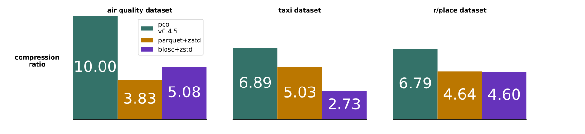
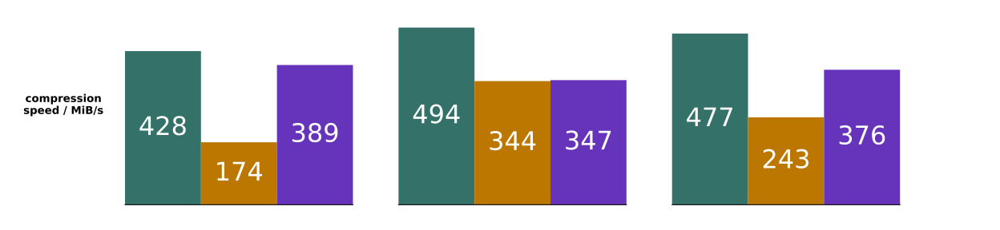
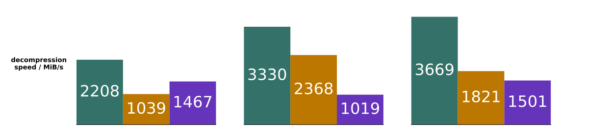

# Results

Below we compare speeds and compressed sizes on 3 real-world datasets.
All these results are available in
[the results CSV](./benchmark_results/mbp_m3_max_rust1_82.csv).
More results are visible in [the paper](https://arxiv.org/abs/2502.06112).
All benchmarks reported here and in the paper can be easily run via
[the CLI](../pco_cli/README.md#bench).

The 3 datasets we compare here are:

* [Devin Smith's air quality data download](https://deephaven.io/wp-content/devinrsmith-air-quality.20220714.zstd.parquet)
  (15MB)
* [NYC taxi data (2023-04 high volume for hire)](https://www.nyc.gov/site/tlc/about/tlc-trip-record-data.page) (469MB)
* Reddit r/place 2022 data
  * [upstream Reddit post and original data](https://www.reddit.com/r/place/comments/txvk2d/rplace_datasets_april_fools_2022/)
  * [processed Parquet file download](https://pcodec-public.s3.amazonaws.com/reddit_2022_place_numerical.parquet)
    (1.3GB)

| dataset     | uncompressed size | numeric data types |
|-------------|-------------------|--------------------|
| air quality | 59.7MB            | i16, i32, i64      |
| taxi        | 2.14GB            | f64, i32, i64      |
| r/place     | 4.19GB            | i32, i64           |

  
  
  

For these results, we used a single performance core of a Macbook Pro M3 Max.
Only numerical columns were used.
For Blosc, the SHUFFLE filter and the Zstd default of Zstd level 3 was used.
For Parquet, the Parquet default of Zstd level 1 was used.

Even at max compression levels, Zstd-based codecs don't perform much better.
E.g. on the Taxi dataset, Parquet+Zstd at the max Zstd level of 22 and Blosc+Zstd
at the max Blosc level of 9 get ratios of 5.32 and 2.85, respectively.
In contrast, Pco gets 6.89 at level 8 and 6.98 at level 12.
