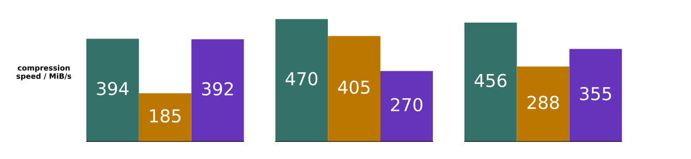
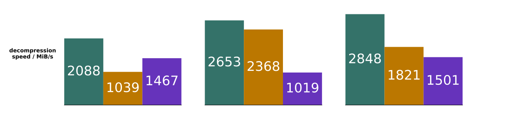

# Results

## Tabular Datasets

Below we compare speeds and compressed sizes on 3 real-world datasets.
All these results are available in
[the results CSV](./benchmark_results/mbp_m3_max_rust1_82.csv).
More results are visible in [the paper](https://arxiv.org/abs/2502.06112).
All benchmarks reported here and in the paper can be easily run via
[the CLI](../pco_cli/README.md#bench).

The 3 datasets we compare here are:

* [Devin Smith's air quality data download](https://deephaven.io/wp-content/devinrsmith-air-quality.20220714.zstd.parquet)
  (15MB)
* [NYC taxi data (2023-04 high volume for hire)](https://www.nyc.gov/site/tlc/about/tlc-trip-record-data.page) (469MB)
* Reddit r/place 2022 data
  * [upstream Reddit post and original data](https://www.reddit.com/r/place/comments/txvk2d/rplace_datasets_april_fools_2022/)
  * [processed Parquet file download](https://pcodec-public.s3.amazonaws.com/reddit_2022_place_numerical.parquet)
    (1.3GB)

| dataset     | uncompressed size | numeric data types |
|-------------|-------------------|--------------------|
| air quality | 59.7MB            | i16, i32, i64      |
| taxi        | 2.14GB            | f64, i32, i64      |
| r/place     | 4.19GB            | i32, i64           |

  
  
  

For these results, we used a single performance core of a Macbook Pro M3 Max.
Only numerical columns were used.
For Blosc, the SHUFFLE filter and the Zstd default of Zstd level 3 was used.
For Parquet, the Parquet default of Zstd level 1 was used.

Even at max compression levels, Zstd-based codecs don't perform much better.
E.g. on the Taxi dataset, Parquet+Zstd at the max Zstd level of 22 and Blosc+Zstd
at the max Blosc level of 9 get ratios of 5.32 and 2.85, respectively.
In contrast, Pco gets 6.89 at level 8 and 6.98 at level 12.

## FCBench

Our average compression ratio on FCBench is the highest we are aware of: **1.96**:

│ dataset             │ compression_ratio │
|─────────────────────|───────────────────|
│ acs_wht_f32         │         1.5973241 │
│ astro_mhd_f64       │         31.561527 │
│ astro_pt_f64        │          1.485383 │
│ citytemp_f32        │         3.8453193 │
│ g24_78_usb2_f32     │         1.2062992 │
│ h3d_temp_f32        │         1.0226607 │
│ hdr_night_f32       │         3.7456813 │
│ hdr_palermo_f32     │         5.8177276 │
│ hst_wfc3_ir_f32     │         1.9663118 │
│ hst_wfc3_uvis_f32   │         1.8880498 │
│ jane_street_f64     │         1.1443204 │
│ jw_mirimage_f32     │         1.4997244 │
│ miranda3d_f32       │         2.1448011 │
│ msg_bt_f64          │         1.2304437 │
│ num_brain_f64       │         1.2447089 │
│ num_control_f64     │         1.1510437 │
│ nyc_taxi2015_f64    │         2.7555883 │
│ phone_gyro_f64      │         3.5785773 │
│ rsim_f32            │         1.7755378 │
│ solar_wind_f32      │         2.6874135 │
│ spain_gas_price_f64 │          9.734698 │
│ spitzer_irac_f32    │         1.4461714 │
│ tpcds_catalog_f32   │         1.2592398 │
│ tpcds_store_f32     │         1.4134144 │
│ tpcds_web_f32       │         1.2571726 │
│ tpch_lineitem_f32   │         3.1502097 │
│ tpch_order_f64      │         2.4985614 │
│ tpcxbb_store_f64    │         3.5908754 │
│ tpcxbb_web_f64      │         3.4475646 │
│ ts_gas_f32          │          3.540374 │
│ turbulence_f32      │          1.342402 │
│ wave_f32            │         2.9820905 │
│ wesad_chest_f64     │         4.5661974 │
